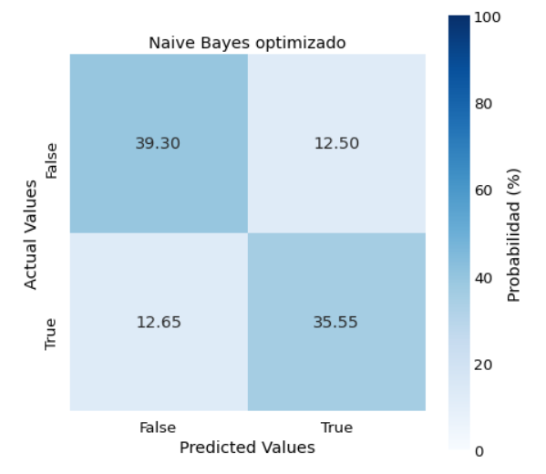

# Predictor of Liability in Traffic Accidents

By employing n-grams, the Naive Bayes classifier captures sequences of words, allowing for a more nuanced understanding of language patterns. This approach enhances the model's ability to explain and predict linguistic structures effectively.

    

Firstly, the notebook "Desafío de Python.ipynb" encompasses data loading, processing, and exploratory analysis. The data consist of various attributes collected by an insurance company, associated with traffic accidents.

Next, the notebook implements several binary classification models to predict an insured's liability in an accident. The conclusion is that the most important attribute for this task is the textual description of the accident.

The chosen model to address the task is the NaiveBayesClassifier from NLTK, trained with n-grams of maximum size 5 from the accident descriptions.

Finally, different steps are proposed before deploying this model to production and making it available for client use.
